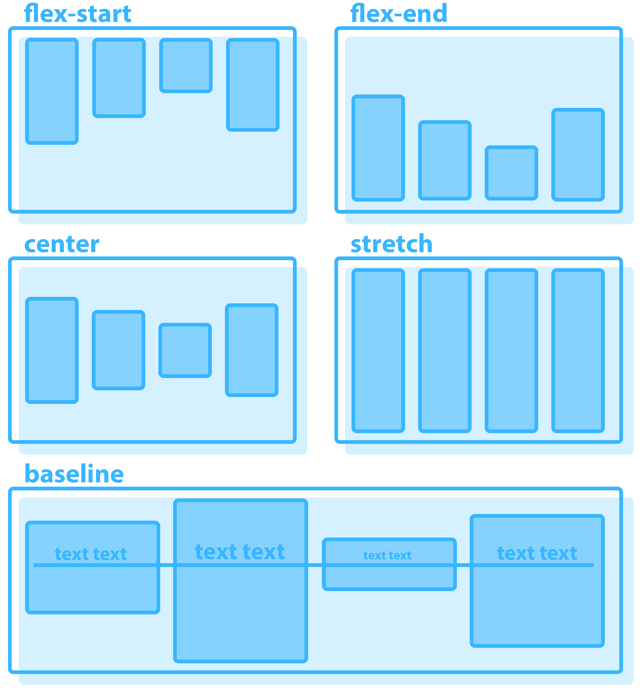

# CSS Flexbox

## Notizen

### Grundbegriffe
- Übergeordneter Container **(Flex Container)**
- Untergeordnete Elemente **(Flex Items)**
- Hauptachse **(Main Axis)**
- Querachse **(Cross Axis)**

### CSS Eigenschaften
#### Flexbox verfügt über 14 CSS- Eigenschaften , von denen 8 für den übergeordneten Container und 6 für die untergeordneten Elemente gelten.

### Eigenschaften des parent container
### display & flex-direction
- **display:** Definiert, ob eine BoxBlock-Flexbox oder eine Inline-Flexbox sein wird.
 * - **_display: flex | inline-flex;_**
 - **flex-direction:** Definiert die Hauptachsen Zeile - X, Spalte - Y.
 * - **_flex-direction: row | row-reverse | column | column-reverse;_**

### flex-wrap
- **flex-wrap:** Legt fest, ob die Elemente auf mehrere Zeilen umbrechen dürfen:
* - **nowrap** (alles in einer Zeile)
* - **wrap** (Umbruch in eine neue Zeile, wenn kein Platz)
* - **wrap-reverse** (wie **wrap**, aber neue Zeile davor)

- **flex-flow:** Da kann mann beides kombinieren, flex-direction & flex-wrap.
**_flex-flow: flex-direction flex-wrap;_**
(je eine, mit abstand in der mitte)

### Main Axis (justify-content)
### justify-content
- **justify-content:** bestimmt Ausrichtung und Abstände der Items entlang der Hauptachse.
* - **flex-start:** Items am Anfang der Achse bündig (links/top).
* - **center:** Items zentriert entlang der Achse.
* - **flex-end:** Items am Ende der Achse bündig (rechts/bottom).
* - **space-between:** Erster an Start, letzter am Ende; gleiche Abstände nur zwischen Items (keine Aussenabstände).
* - **space-around:** Gleicher Abstand um jedes Item; Aussenabstände sind halb so gross wie die Abstände zwischen Items.
* - **space-evenly:** Gleiche Abstände zwischen Items und zu den Containerkanten.

### Cross Axis (align-items)
### align-items
- **align-items:** bestimmt Ausrichtung der Items entlang der Querachse.
* - **stretch:** Items füllen die ganze Höhe/Breite der Querachse aus (Standard).
* - **flex-start:** Items am Anfang der Querachse.
* - **center:** Items zentriert auf der Querachse.
* - **flex-end:** Items am Ende der Querachse.
* - **baseline:** Ausrichtung am Text-Baseline der Inhalte.

### align-content
- **align-content:** Definiert die Ausrichtung der Items entlang der Querachse (cross axis). Funktioniert __NICHT__, wenn sich die Items in nur einer einzigen Zeile befinden (das heisst, wenn __*flex-wrap*__ den Wert __*nowrap*__ hat, funktioniert es __NICHT__).
* - **align-content:**| flex-start | flex-end | center | space-between | space-around | space-evenly | stretch

### flex-grow

### Eigenschaften des child container